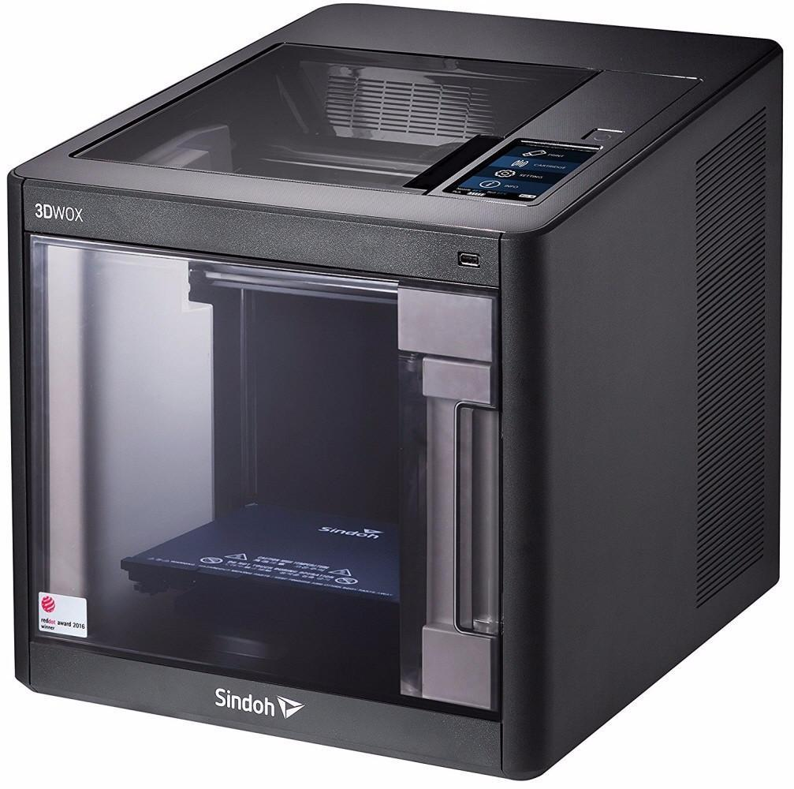

 # SINDOH 3DWOX

 ## What is 3D printing 
#### 3D printing is a process where a three-dimensional object is made by joining or solidified material in a computer controlled way (such as liquid molecules or powder grains being fused together), typically layer by layer. 

* #### There are several techniques to join the material; melting plastic and laying it on top of each other (FDM or fused deposition modeling), fusing powder together or fusing liquid molecules together.
* #### The 3DWOX printer makes objects by stacking different layers of molten plastic on top of each other.
 * #### This machine is used to print 3D objects as per the design.

## Operating Procedure

1. #### Cleaning the build plate for any dust or plastic remains before starting the activity.
2. #### switch on the machine with power supply of 110v/240v.
3. #### Inserting filament to the cartridge and loading the cartridge in to the machine.
4. #### The plastic filament used have dia of 1.75 mm and the extruder compress it to 0.40 mm while printing.
    

[go to home](/readme.md)