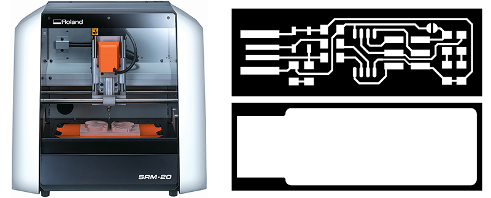
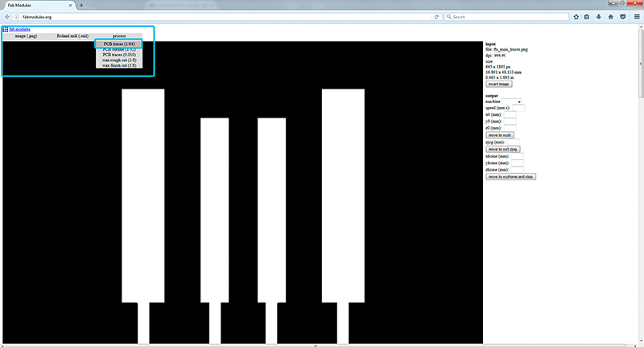
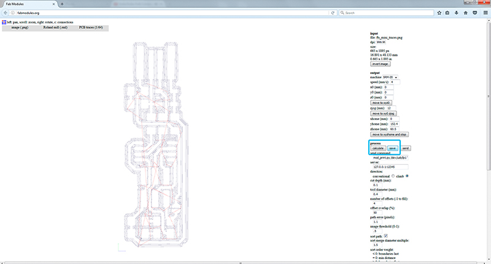
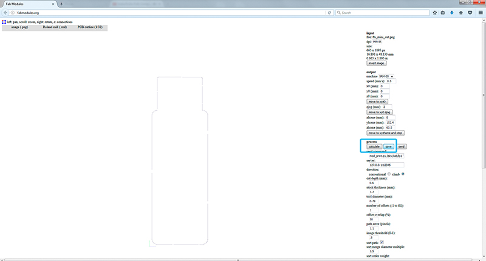
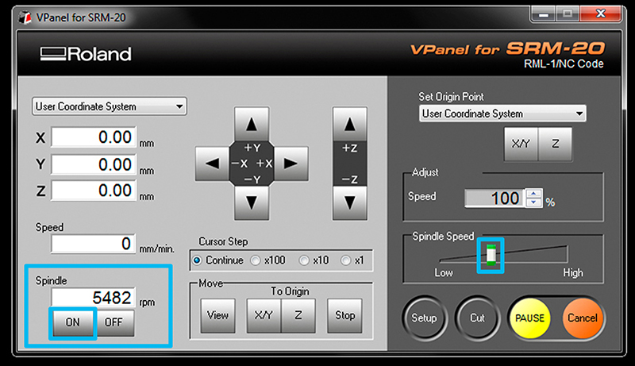
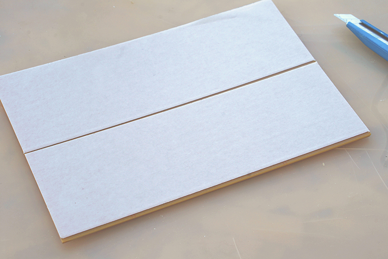
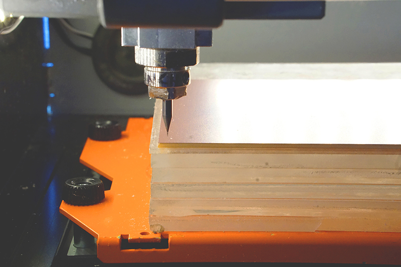
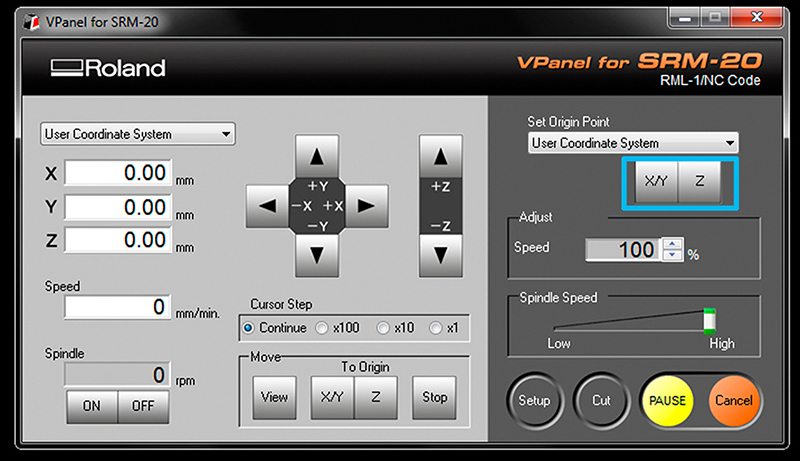

# monoFab SRM-20

### 1. Turn on the printer, turn on the windows computer and connect with each other.
### 2. Create and save file of circuit board traces and out cut. Physically load circuit board and 1/64” endmill to SRM. 
### 3. Find zero for x, y, and z.Set settings on the computer to mill then send to SRM 20. 
### 4. Mill your PCBs Remove board, cut out if desired, cut apart any areas that didn’t make it. 
### 5.Finally, solder your components to your freshly made board! 

# Procedure 

## Step 1 obtain the files:: Find or Design a Circuit Board Export/save your board design as .png, 

#### * traces 
#### * holes drill 
#### * outline

##  Step 2: fab modules - Traces (1/64)
### traces image file (This is the one with lines that   will form the wires between  components.) 

* input format - PNG - select your traces image 
* output format - roland mill (.rml) 
* process - PCB traces (1/64)

### Always check the real size and resolution of your board.Machine - SRM-20 

* x0(mm) - 0 
* y0(mm) - 0 
* z0(mm) - 0 
* zjopg - 2 
* Speed - 4 or 3 mm/s for new end mills.

x/y/x home is the parking position after finishing the cut

Click “calculate”
Now you can see the tool path (blue lines for cut,red for movements in the air),this should outline all your traces. Iterate your design if you see something wrong with them.
and after “save”

## Step 3: fab modules - Outcut/Holes

Refresh fab modules

Now your outline/holes image file
* input format - PNG - select your traces image
* output format - roland mill (.rml)
* process - PCB outline (1/32)

Always use the same x0,y0,zO that you used for the trace files or both cuts will not match.
    Machine - SRM-20
    x0(mm) - 0
    y0(mm) - 0
    z0(mm) - 0
    zjopg - 12
    Speed - 0.5

Click “calculate”(you should see a blue path) and after “save”

## Step 4: Tape down your board in the Modela.
Turn on Roland Modela and the computer and open VPanel for SRM-20 
A nice tip is to warm the spindle for 10 min at mid Rpm before using it.

* Machine Setup should be configured to “understand” the G-CODE generated by fab modules, so before cutting go to setup and check RML-1/NC CODE and mm are selected.Get a circuit board blank ready.

 * Clean off the dust and fingerprints. No, for real, go do that. Then avoid getting more fingerprints on them.If there are any smudges then wash them in a sink with some soap and water then dry well. 
 * If it seems clean like it’s right out of the bag then it’s probably OK. Fingerprints make it harder to solder onto once the board is done.Press the “view” button on the Modela to toggle between loading and loaded positions. There should be a piece of wood/acryl taped down on the machine securely already.   
 * This is known as the “sacrificial board” because you mill into it so you don’t mill the own machine.    Make sure it’s steady and flat.    Clean the residues of any dust or particles. Help you with a spatula for that task.    Apply double sided tape all the way across (see photo).    Make sure it’s flat as well, with no folds, particles or overlaps under or on it. 

     

## Step 5: Set the X/Y/Z zeros

You may want to start your file slightly inside your physical board. The (0,0) of your file created in fab modules is in the bottom left corner.

Machine Setup should be configured to “understand” the G-CODE generated by fab modules, so before cutting go to setup and check RML-1/NC CODE and mm are selected.

Be carefull to don’t touch the PCB with the end mill while moving or it will break.

Set Z zero,the Z is slightly more complicated    Move the Z slowly with the control panel around 3-5 mm above the PCB plate.
Now we are going to do the Z manually by loosing the collect screw and land the endmill on the surface.
Slowly loosen the mill bit with an allen wrench so that it
drops gently to the surface of your board.
Don’t let the endmill fall free on the surface or it can break.(help you with a finger pressing on the side of the endmill)
Press “slightly down” the PCB board, around 0.5mm and tight the endmill with the screw on the collet.

Now save the Z origin in the Vpanel control panel.

* #### As a small milling machine, the SRM-20 offers compact size and powerful functionality at an affordable price. 
* #### Production of realistic parts and prototypes is made simple and convenient with a device that fits into any office, home, or classroom environment.
* #### For users looking for advanced milling capabilities without the need for expert operating skills, the SRM-20 is the easiest and most precise CNC mill in its class.

Here SRM-20 is install,It is a machine to perform small fabrics with resolution of 1 micron. The build plate is 1x3/32 mm The milling tool can perform 2 port cutting, 4 port cutting and could be flat nose or balled nose.

[go to home](/readme.md)