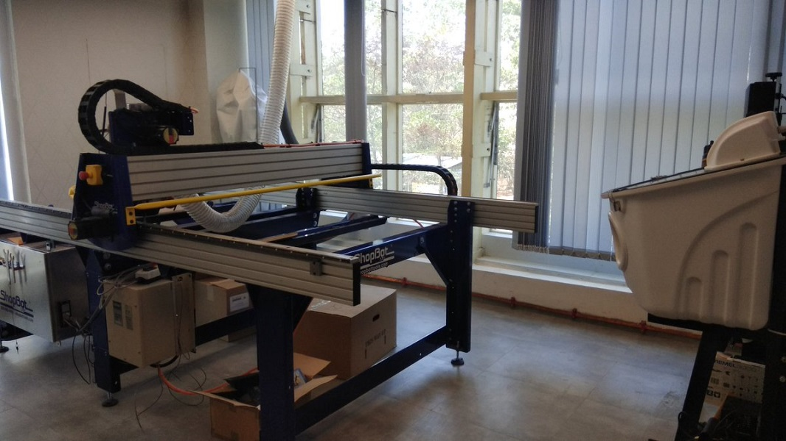

###### Shop bot CNC #######

its a 3 axis xx' ,yy' and zz'

it create cutting is shape of materials wood,plastic,foam,aluminum.

This a dangerous machine which need more safety.

It need to ensure of safety before start the machine.

  1.Ear Guard for noise prevention
  2.Mask for dust prevention
  3.all should out only two person allowed to control the shop bot.
  4.when machine start no one should not touch machine.

one site in computer and other must hold three bottom control.

if emergency a emergency bottom must be press.

Reset bottom is use for start the shop bot.Switch on the controller and set the origin zero using the zero plate.

two power supply one is for spindle and other is for control unit.

its has a spindle which separate power supply

spindle rotates at a speed of 14000 rpm and any problem may hurt the operator and the lab manager.

In the shop bot lab there are other three 
 1.Scroll saw (for cutting woods)
 2.Band saw
 3.Object water jet

 

 
[go to home](/readme.md)
