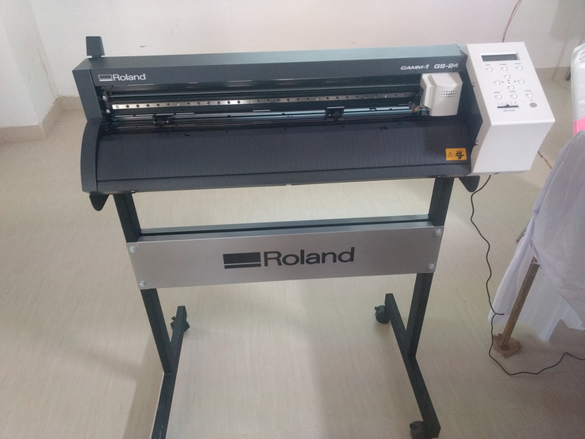

# Vinyl Cutter

Vinyl cutter in our fab lab is brand of Roland.
1.how to fix vinyl spindle for cutting
2.How to load the vinyl roll.
it has a small knife which should be take care for its tips for Better cutting  of designed images.The knife is fitted with turners and its moves side to side.Vinyl is put under the knife for cutting.two roller which need to roll the fed vinyl.It Can be used as plotter too. it is a 2 axis machine.

